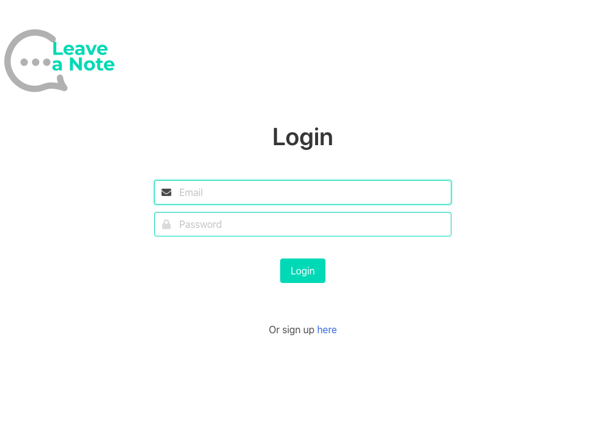
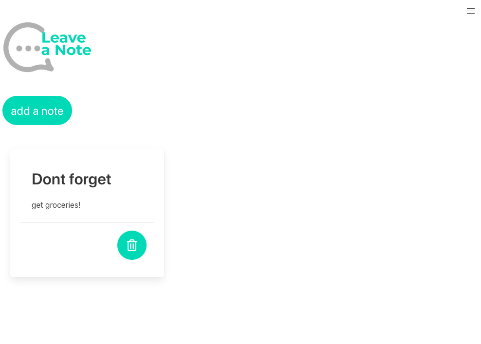
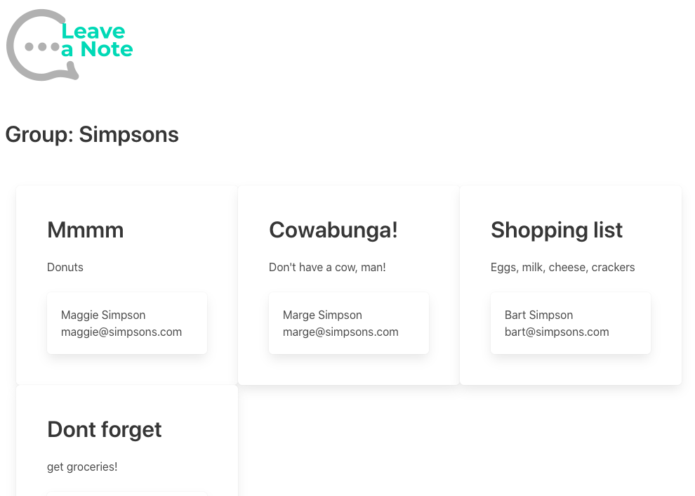
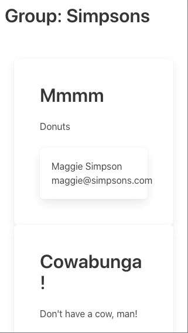
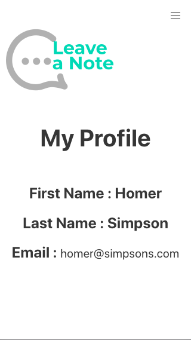

# LeaveANote


## Live website

https://project-leave-a-note.herokuapp.com/

This app allows users to log in and leave a note for their groups. It also allows them to view notes left for them by other users in their group.

Following the [common templates for user stories](https://en.wikipedia.org/wiki/User_story#Common_templates), we frame our project goals as follows:

```
As a member of a group
I want to post and read notes from the group on a message board
So that I enhance communication with my group

Acceptance Criteria for MVP:
Users should be able to register for an account.
Users should be able to login and see their respective, (assigned, private, isolated, password) protected.
Application should allow users to create and save notes.
Application should allow users to view previously saved notes.
Application should allow users to delete previously saved notes.
Application should allow users edit (update) current notes.
Application has an intuitive mobile first user interface.
Application should work on mobile, tablet and desktop screen sizes.
Application should have consistent styling across the application.
Note data based on users should persist note data based on users.
```

## Table of contents

- [Usage](#usage)
- [License](#license)
- [Contributions](#contributions)
- [Questions](#Questions)

## Usage

  
Desktop login page

  
Desktop home page

  
Desktop group page

  
Mobile group page

  
Mobile profile page

## License

[GNU GPL3](https://choosealicense.com/licenses/gpl-3.0/)

## Contributions

Please email regarding any contributions.

## Questions

For any questions, please contact:

| Author       |                           GitHub                           |           Email           |
| ------------ | :--------------------------------------------------------: | :-----------------------: |
| Raihan Akter | [visit Raihan's github](https://github.com/RaihanAkter03/) | <raihanakter26@gmail.com> |
| Ben Galloway |      [visit Ben's github](https://github.com/BenjDG/)      | <bdgalloway85@gmail.com>  |
| Julian Huynh |    [visit Julian's github](https://github.com/jhuynh24)    |                           |
| Greg Stead   |    [visit Greg's github](https://github.com/gregstead/)    |   <gregstead@gmail.com>   |
